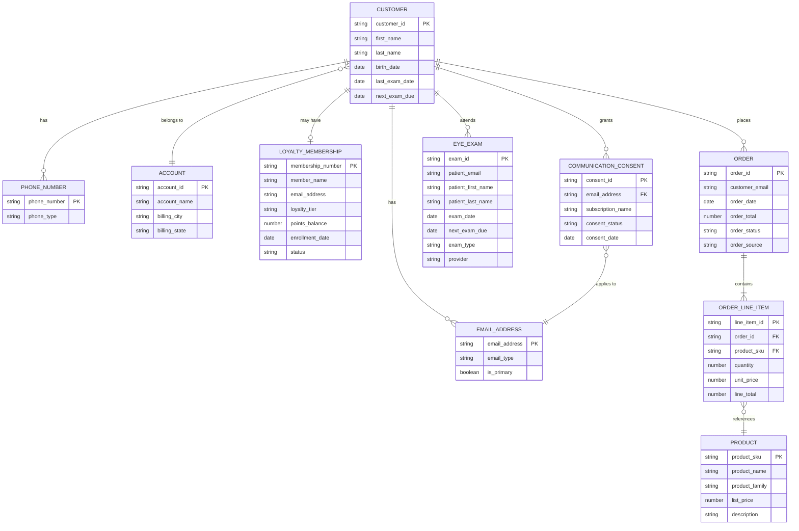
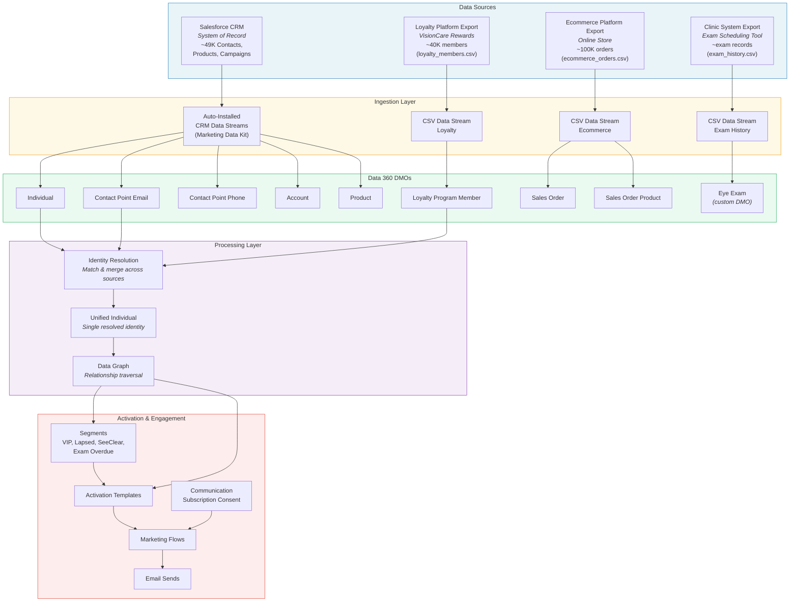
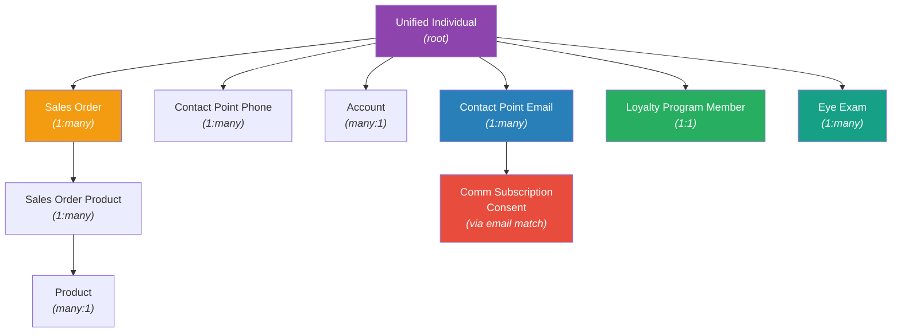

# LEOptical — Data Model

## Business Entity Relationship Diagram

This ERD represents LEOptical's business data — the entities, relationships, and cardinality from the client's perspective. This is the diagram learners see first, before learning how it maps to Data 360 DMOs.



## Data Source & Flow Diagram

This diagram shows where LEOptical's data originates, how it enters Data 360, and what happens after ingestion. Learners should understand this end-to-end flow before they start building.



## Data 360 DMO Mapping

How each business entity maps to a Data 360 DMO, what sources feed it, and the ingestion method.

| Business Entity | Data 360 DMO | DMO Type | Source(s) | Ingestion Method |
|----------------|-------------|----------|-----------|-----------------|
| Customer | **Individual** | Standard | CRM Contact | Auto (Marketing Data Kit) |
| Email Address | **Contact Point Email** | Standard | CRM Contact + Loyalty CSV + Ecommerce CSV + Exam CSV | Auto (CRM) + created during IDR from CSV email fields |
| Phone Number | **Contact Point Phone** | Standard | CRM Contact | Auto (CRM) |
| Account | **Account** | Standard | CRM Account | Auto (CRM) |
| Loyalty Membership | **Loyalty Program Member** | Standard + custom fields | Loyalty CSV | CSV data stream |
| Order | **Sales Order** | Standard (manually enabled) | Ecommerce CSV | CSV data stream |
| Order Line Item | **Sales Order Product** | Standard (manually enabled) | Ecommerce CSV | CSV data stream |
| Product | **Product** | Standard | CRM Product (anonymous Apex) | Auto (CRM) |
| Eye Exam | **Eye Exam** | Custom | Exam History CSV | CSV data stream |
| Communication Consent | **Comm Subscription Consent** | Standard | Consent automation flow (Module 5) + landing page forms | Flow-created / form-created |
| — | **Unified Individual** | Standard | Post-IDR (system-generated) | Automatic after IDR runs |

## Field-Level Mappings

### Individual (from CRM Contact)

Auto-mapped by Marketing Data Kit. Custom fields added to CRM Contact flow through automatically.

| Individual Field | CRM Contact Field | Type | Required | Notes |
|-----------------|-------------------|------|----------|-------|
| First Name | FirstName | Text | No | |
| Last Name | LastName | Text | Yes | ~5% of seed data has this missing (dirty data) |
| Birth Date | Birthdate | Date | No | |
| Last Exam Date | Last_Exam_Date__c | Date | No | Custom field on Contact |
| Next Exam Due | Next_Exam_Due__c | Date | No | Custom field on Contact |

### Contact Point Email (from CRM Contact)

| Contact Point Email Field | CRM Contact Field | Type | Notes |
|--------------------------|-------------------|------|-------|
| Email Address | Email | Email | Primary CRM email |
| Email Type | — | Text | Defaults to "Primary" for CRM |

> Additional Contact Point Email records are created during IDR from loyalty, ecommerce, and exam CSV email addresses.

### Contact Point Phone (from CRM Contact)

| Contact Point Phone Field | CRM Contact Field | Type | Notes |
|--------------------------|-------------------|------|-------|
| Telephone Number | Phone | Phone | Mixed formats in seed data (dirty data) |
| Phone Type | — | Text | |

### Account (from CRM Account)

| Account Field | CRM Account Field | Type | Notes |
|--------------|-------------------|------|-------|
| Account Name | Name | Text | Personal accounts for B2C |
| Billing City | BillingCity | Text | |
| Billing State | BillingState | Text | |

### Product (from CRM Product)

| Product Field | CRM Product Field | Type | Notes |
|--------------|-------------------|------|-------|
| Product Name | Name | Text | |
| Product SKU | ProductCode | Text | e.g., VIS-ULX-001 |
| Product Family | Family | Text | "Visionaire" or "SeeClear" — standard Salesforce field |
| List Price | — | Number | From PricebookEntry |
| Description | Description | Text | |

**Product catalog:**

| Product Name | SKU | Family |
|-------------|-----|--------|
| Visionaire UltraLux | VIS-ULX-001 | Visionaire |
| Visionaire ChromaShift | VIS-CHS-001 | Visionaire |
| SeeClear DailyFocus | SEC-DLF-001 | SeeClear |
| SeeClear SunSync | SEC-SNS-001 | SeeClear |
| LEOptical Designer Frames | LEO-FRM-001 | Frames |

### Loyalty Program Member (from Loyalty CSV)

Standard DMO with custom fields added for tier and points.

| DMO Field | CSV Column | Type | Standard/Custom | Notes |
|-----------|-----------|------|-----------------|-------|
| Membership Number | membership_number | Text | Standard | PK — e.g., LM-00001 |
| Name | first_name + last_name | Text | Standard | Concatenated |
| Enrollment Date | enrollment_date | DateTime | Standard | |
| Loyalty Program Member Status | status | Text | Standard | Active / Inactive |
| Loyalty Tier | loyalty_tier | Text | Custom | Bronze / Silver / Gold / Platinum |
| Points Balance | points_balance | Number | Custom | Current points |
| Email Address | email | Email | Custom | Often differs from CRM email — key for IDR |
| Phone | phone | Phone | Custom | Mixed formats (dirty data) |
| Email Opt-In | email_optin | Boolean | Custom | Some rows contradict unsubscribed_date (dirty data) |
| Unsubscribed Date | unsubscribed_date | DateTime | Custom | Sometimes set even when optin=true (dirty data) |

**Loyalty tier thresholds (for reference and segmentation boundary testing):**

| Tier | Min Points | Max Points |
|------|-----------|------------|
| Bronze | 0 | 24,999 |
| Silver | 25,000 | 49,999 |
| Gold | 50,000 | 74,999 |
| Platinum | 75,000 | — |

### Sales Order (from Ecommerce CSV)

| DMO Field | CSV Column | Type | Notes |
|-----------|-----------|------|-------|
| Sales Order Id | order_id | Text | PK — e.g., ORD-100001 |
| Order Date | order_date | DateTime | Mixed formats in CSV: MM/DD/YYYY (dirty data) |
| Total Amount | order_total | Number | |
| Status | order_status | Text | Completed / Cancelled / Returned |
| Customer Email | customer_email | Email | For IDR — may differ from CRM/loyalty email |
| Order Source | order_source | Text | "ecommerce" |

### Sales Order Product (from Ecommerce CSV)

| DMO Field | CSV Column | Type | Notes |
|-----------|-----------|------|-------|
| Sales Order Product Id | line_item_id | Text | PK |
| Sales Order | order_id | Text | FK to Sales Order |
| Product | product_sku | Text | FK to Product — some SKUs don't exist (dirty data: orphaned orders) |
| Quantity | quantity | Number | |
| Unit Price | unit_price | Number | |
| Line Total | line_total | Number | |

### Eye Exam (Custom DMO — from Exam History CSV)

| DMO Field | CSV Column | Type | Required | Notes |
|-----------|-----------|------|----------|-------|
| Eye Exam Id | exam_id | Text | Yes | PK — e.g., EX-50001 |
| Patient Email | patient_email | Email | Yes | For IDR |
| Patient First Name | patient_first_name | Text | No | |
| Patient Last Name | patient_last_name | Text | No | |
| Exam Date | exam_date | Date | Yes | Format: DD-Mon-YYYY in CSV (dirty data) |
| Next Exam Due | next_exam_due | Date | No | Recommended next visit |
| Exam Type | exam_type | Text | No | Comprehensive / Follow-up / Contact Lens Fitting |
| Provider | provider_name | Text | No | Examining doctor name |

### Communication Subscription Consent (flow-created)

| DMO Field | Source | Type | Notes |
|-----------|--------|------|-------|
| Consent Status | Flow logic | Text | OPT_IN or OPT_OUT |
| Consent Date | Flow logic | DateTime | When consent was captured |
| Communication Subscription | Flow logic | Text | Which subscription (see below) |
| Email Address | Contact Point Email lookup | Email | Relates to CPE via email match (Party field workaround) |

## Communication Subscriptions

LEOptical has four communication subscriptions, configured in Modules 4-5. Learners customize the preference center to display the marketing subscriptions.

| Subscription | Type | Preference Center | Description |
|-------------|------|-------------------|-------------|
| **Promotional Offers** | Marketing | Yes — opt-in/out toggle | Sales, discounts, product launch announcements |
| **VisionCare Rewards Updates** | Marketing | Yes — opt-in/out toggle | Loyalty tier changes, points reminders, member exclusives |
| **Eye Health Reminders** | Marketing | Yes — opt-in/out toggle | Exam overdue notices, annual checkup reminders |
| **Order Updates** | Transactional | No — not shown | Order confirmations, shipping updates, review requests |

> **Teaching moment (Module 4):** "Order Updates" is transactional — it can be sent without marketing opt-in. This is how the post-purchase review request flow (Module 24) reaches customers who haven't opted into marketing. Learners verify this by sending an order update to a contact without marketing consent and confirming delivery.

## Data Graph Structure

The Data Graph is rooted on **Unified Individual** (the post-IDR resolved identity). This is what powers Handlebars personalization in emails and dynamic content resolution.



**What this graph supports:**

| Use Case | Graph Traversal |
|----------|----------------|
| VIP Customers segment | Unified Individual -> Loyalty Program Member -> Loyalty Tier = Gold/Platinum |
| Lapsed Buyers segment | Unified Individual -> Sales Order -> Order Date (max) > 180 days ago |
| SeeClear Enthusiasts segment | Unified Individual -> Sales Order -> Sales Order Product -> Product -> Family = "SeeClear" |
| Exam Overdue segment | Unified Individual -> Eye Exam -> Exam Date > 12 months ago (or Individual.Last_Exam_Date) |
| Handlebars: first name | Unified Individual -> First Name |
| Handlebars: loyalty tier | Unified Individual -> Loyalty Program Member -> Loyalty Tier |
| Handlebars: purchase repeater | Unified Individual -> Sales Order -> Sales Order Product -> Product Name (last 3) |
| Activation template: email selection | Unified Individual -> Contact Point Email (select which one to send to) |
| IDR matching | Contact Point Email across CRM, loyalty, ecommerce, exam sources |

## Data Refresh Dependency Chain

This sequence must complete in order for dynamic content to resolve in emails:

```
1. Data Streams refresh (CSV + CRM data ingested into DMOs)
       |
2. Identity Resolution runs (records matched & merged into Unified Individuals)
       |
3. Data Graph refreshes (relationships resolved across DMOs)
       |
4. Dynamic content resolves (Handlebars expressions find data in the graph)
```

> If a learner's personalization isn't rendering, check this chain in reverse: Is the Data Graph refreshed? Has IDR run? Did the data stream finish ingesting?
