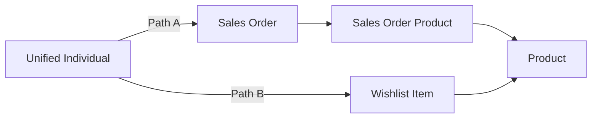

## Overview

You have Unified Individuals. Now you use them. Segmentation is the first place in MCA where all the upstream work pays off: the ingested data, the identity resolution, the Data Graph. A segment takes that unified view and answers one question: who is in this audience?

This lesson covers the mechanics of the segment builder in full. You will learn what each segment type is for, how the canvas is structured, how containers work, how the lookback window affects evaluation, and exactly what happens when you click Publish.

The guided walkthrough and the four LEOptical segments are in the next lesson. Read this one first.

## Lesson overview

This section contains a general overview of topics that you will learn in this lesson.

- What the four segment types are and when to use each.
- The segment builder canvas: Segment On, Include/Exclude tabs, and the attribute sidebar.
- Direct attributes vs related attributes, and why the distinction matters.
- Containers: how they evaluate, what aggregation options are available, and how the lookback window works.
- Traversal paths: when they appear, how to choose, and why the path affects segment results.
- Using published segments as criteria: Include and Exclude tabs, copy criteria vs. last published, and rank and limit.
- Logic operators at the filter level and the container level.
- Population counts and the on-demand preview.
- The publish lifecycle: why a Draft segment has no members and what happens during first publish.
- Publish schedule options and Rapid Publish mode.
- Exclusions and common suppression patterns.

## Segment types

MCA supports four segment types. This course builds **Standard** segments throughout. You should know the others exist so you recognize them when clients ask.

| Type | What it is | Cadence | Data window |
|------|-----------|---------|-------------|
| **Standard** | DMO-based segment with persisted membership. The default. | 12 hrs, 24 hrs, or Manual | Up to 2 years |
| **Waterfall** | Ordered list of segments. Each individual lands in the first segment they qualify for only. Built from existing Standard segments. | Inherits constituent schedule | Up to 2 years |
| **Real-Time** | Evaluates in milliseconds against a real-time data graph. No exclusion criteria, no population counts. | On demand only | Current state |
| **Dynamic** | Parameterized definition. An external caller passes filter values at runtime. No membership DMO is persisted. | API-triggered | Varies |

For the full reference on segment types and statuses, see the [Salesforce Help article on Segment Types and Statuses](https://help.salesforce.com/s/articleView?id=data.c360_a_segment_types_statuses.htm).

**Standard** is the right choice for virtually every email campaign audience. Use the others when you have a specific reason to.

:::info
"Nested segment" is not a segment type. It describes what happens when you use an existing published Standard segment as a filter criterion inside another segment. You build it with the same Standard type. The nesting is a configuration choice, not a separate type.
:::

**Rapid Publish** is not a segment type. It is a publish mode you can enable on a Standard segment when you need 1-hour or 4-hour refresh cadences. It has restrictions: it only looks at the last 7 days of data, is limited to 20 segments per org, and only activates to MCE and cloud file storage targets.

**Real-Time** segments are for Agentforce use cases where a millisecond response is required. They do not support exclusion criteria, do not show population counts, and cannot contain nested batch segments. Do not use them for email campaigns.

**Waterfall** segments enforce mutual exclusivity. Each Unified Individual lands in exactly one segment in the waterfall, whichever they qualify for first. The waterfall can contain up to 20 segments. You would use this for tiered offer programs where Gold members should receive a Gold offer and never see the Bronze offer, even if they technically qualify for both.

**Nested** segments let you use a published segment as a building block inside another segment. The use case is reuse: if "All Consented Customers" is a shared definition, multiple teams can reference it without duplicating the filter logic.

**Dynamic** segments require API integration and are an advanced use case. They are not covered in this course.

## The segment builder canvas

When you create a Standard segment and open the builder, the canvas has three elements worth understanding before you build anything.

<ScreenshotPlaceholder alt="Segment builder canvas in its empty state showing the Segment On selector at the top, Include and Exclude tabs, and the attribute sidebar on the right with Direct Attributes and Related Attributes sections visible" />

### Segment On

**Segment On** is the DMO the segment counts members of. Every filter you add returns a count of distinct members of this DMO. For all MCA use cases with Identity Resolution configured, this should always be **Unified Individual**.

If you segment on the raw Individual DMO instead, you count the same real person multiple times (once per source record). A customer who appears in CRM, the loyalty system, and ecommerce orders would count as three members. Do not do this.

### Include and Exclude tabs

The **Include tab** is where you define who qualifies for the segment. At least one Include rule is required.

The **Exclude tab** is where you define who gets removed from the segment even if they meet the Include criteria. Exclusions run after Include is evaluated, as a subtraction. The Exclude tab supports the same attribute sidebar, container logic, and operators as the Include tab.

Real-Time segments do not have an Exclude tab.

### The attribute sidebar

The attribute sidebar shows all available filters, organized into two categories:

- **Direct attributes:** fields that resolve to a single value per Unified Individual. This includes fields unified directly onto the Unified Individual DMO (like first name, birth date, city) and fields from any DMO that has a one-to-one relationship with Unified Individual.
- **Related attributes:** fields from DMOs with a one-to-many relationship to the Segment On DMO. Multiple records can exist per Unified Individual. Examples: Sales Orders, Eye Exams, email engagement events.

Dragging a direct attribute onto the canvas adds a simple filter. Dragging a related attribute creates a **container** for that DMO.

## Direct attributes

A direct attribute is a field that resolves to exactly one value per Unified Individual. This covers two categories: fields that are unified directly onto the Unified Individual record (identity fields, profile fields from CRM), and fields from DMOs that have a strict one-to-one relationship with Unified Individual. Drag a direct attribute onto the canvas and it adds a simple filter row with an operator and a value input. No container is needed.

Filter operators vary by data type:

| Data type | Available operators |
|-----------|-------------------|
| Text | Contains, Begins With, Is In, Is Not In, Is Equal To, Is Not Equal To |
| Number | Is Equal To, Is Not Equal To, Is Less Than, Is Less Than Or Equal To, Is Greater Than, Is Greater Than Or Equal To, Is Between |
| Date / DateTime | Is Anniversary Of, Is Before, Is After, Is Between, Last Number Of Days, Next Number Of Days, Day Of Week |
| Boolean | Has Value, Has No Value, Is True, Is False |

You can combine multiple direct attribute filters with AND or OR logic. The population count updates per filter as you build.

<ScreenshotPlaceholder alt="Segment canvas showing a direct attribute filter on Individual First Name with an Is Equal To operator and a text value, and the population count displayed below the filter row" />

For LEOptical, direct attributes you might filter on include first name or city, both of which are standard fields on the Individual DMO populated from CRM Contact data.

## Related attributes and containers

This is the most important concept in the segment builder. Spend time here.

### What a container is

When you drag a related attribute onto the canvas, the builder creates a **container** for that related DMO. A container is a group of filters that evaluate against all records in that related DMO for each Unified Individual.

The key behavior: the platform looks at every record for that individual in the related DMO. The individual qualifies for the container if their collective records satisfy the criteria.

This distinction between same-record evaluation and across-records evaluation matters a lot.

Consider this example: you want customers who bought a yellow scarf.

- **One container** with Product Category = "Scarves" AND Color = "Yellow" finds customers who have a single order record where the category is Scarves and the color is Yellow. Both conditions evaluate against the same record.
- **Two separate containers**, Container A with Product Category = "Scarves" and Container B with Color = "Yellow", finds customers who have any scarf order AND any yellow order, even if those are two different order records. The containers evaluate independently.

AND logic between filters inside a container: both conditions must be true on the same related record.

AND logic between two containers: the individual must satisfy each container's criteria, but the records satisfying each container do not need to be the same record.

<ScreenshotPlaceholder alt="Segment canvas showing a Sales Order container with two filters inside it connected by AND: Order Date Last Number Of Days 30 AND Total Amount Is Greater Than 100" />

### Aggregation options

Inside a container, you choose how to aggregate the related records before applying the filter. Five options:

| Aggregation | What it evaluates | LEOptical example |
|------------|------------------|------------------|
| **Count** | Number of matching records | "Has placed at least 3 orders" |
| **Sum** | Total of a numeric field across matching records | "Total order spend over $500" |
| **Average** | Mean of a numeric field across matching records | "Average order value over $100" |
| **Min** | Lowest value in a numeric or date field | "Earliest exam date before 2024" |
| **Max** | Highest value in a numeric or date field | "Most recent order within the last 30 days" |

Count works with any data type. Sum, Average, Min, and Max require a numeric or date field.

The aggregation you choose determines what the filter operator applies to. If you choose Max(Order Date), the operator compares against the most recent order date, not any individual order date.

### The lookback window

The lookback window limits how far back in time the segment engine looks at related records. The default is 90 days. You set it once in the segment creation wizard. It applies at the segment level and cannot be adjusted per container after the segment is created.

For a Sales Order container with a 90-day lookback, the engine only considers orders placed in the last 90 days. An order from two years ago does not exist from the segment's perspective.

The lookback window is a design decision, not just a setting. A shorter lookback is faster to process and consumes fewer credits. A longer lookback captures more history but increases processing time and cost. For LEOptical's Exam Overdue segment (detecting contacts with no exam in 12 months), a lookback window of at least 365 days or more is required, or the segment will miss contacts whose last exam was more than 90 days ago.

Rapid Publish segments lock the data window to 7 days regardless of your lookback setting. This is a hard constraint, not a configuration choice.

Profile data (direct attributes on Unified Individual) has no lookback window. Lookback only applies to related attribute containers.

### Filters within a container

You can add multiple filters inside a single container and combine them with AND or OR logic. The filters all evaluate against the same related DMO's records.

### Between containers

An individual must satisfy each container's criteria to qualify when containers are connected by AND. The containers evaluate independently. The records satisfying Container A do not need to be the same records satisfying Container B.

When containers are connected by OR, qualifying for either container is enough.

<ScreenshotPlaceholder alt="Segment canvas showing two containers (a Loyalty Program Member container and a Sales Order container) connected by an AND operator between them, each with their own filters" />

### Nesting

You can nest operator logic multiple levels deep inside a segment. This enables complex boolean expressions. The platform supports multiple levels of nesting.

{/* VERIFY: Exact maximum nesting depth in Summer '26. Research found conflicting numbers (5 vs 10 levels). Verify in SDO. */}

## Traversal paths

A traversal path defines the relationship chain the segment engine follows to reach a related attribute. When there is only one path from the Segment On DMO to the attribute you want, the engine uses it automatically. When the same attribute is reachable by more than one chain, the builder prompts you to choose.

{/* VERIFY: Exact UI behavior when a traversal path prompt appears. Does it appear inline on the canvas when you drop the attribute, or as a modal dialog? Confirm in SDO when building SeeClear Enthusiasts. */}

Why does the path matter? Different paths traverse different relationship edges, which means they filter against different sets of related records. Two paths that lead to the same DMO can produce completely different segment populations.

Consider a hypothetical where **Product** can be reached two ways from Unified Individual:

- **Path A** (through Sales Order → Sales Order Product → Product) finds individuals who **purchased** a product matching your filter.
- **Path B** (through Wishlist Item → Product) finds individuals who **wishlisted** a product matching your filter.

Both paths end at the Product DMO, but they mean completely different things. If you choose the wrong path, your segment finds the wrong people, with no error or warning to tell you.

For LEOptical, the SeeClear Enthusiasts segment traverses Unified Individual → Sales Order → Sales Order Product → Product. There is only one path in the data model, so the prompt does not appear. But if a Wishlist DMO were added later and connected to Product, the prompt would appear and the correct path is the purchase path.

An important constraint: **linked field values are case-sensitive**. If the join key value is `SeeClear` in one DMO and `seeclear` in another, the relationship does not resolve.

Only one traversal path per container.

<ScreenshotPlaceholder alt="Traversal path selection UI showing a dropdown or modal with two relationship chain options to reach the Product DMO, with one option highlighted" />

## Using segments as criteria

Published segments can be used as filter criteria inside another segment. This is how the Nested segment type works, and it is one of the more useful patterns in the builder.

### Where to use them

You can use a segment as a criterion on both the **Include tab** and the **Exclude tab**. On the Include tab, adding a segment as a criterion restricts the population to individuals already in that segment. On the Exclude tab, it removes from the current segment anyone who is already in the referenced segment.

This is useful for suppression patterns. If "All Consented Customers" is a published segment, you can reference it on the Include tab of every promotional segment to enforce consent without duplicating the filter logic.

### Copy criteria vs. last published

When you add a segment as a criterion, the builder offers two options for how to evaluate it:

- **Copy criteria:** The referenced segment's filter logic is copied into the current segment at save time. Changes to the referenced segment do not automatically propagate. The current segment evaluates the copied logic independently.
- **Use last published:** The current segment evaluates against the most recent published membership list of the referenced segment. If the referenced segment has not been published since its last change, the current segment uses the prior membership state.

{/* VERIFY: Confirm the exact UI labels for these two options in the Summer '26 builder. "Copy criteria" and "Use last published" are the expected labels based on research but confirm in SDO. */}

Use "copy criteria" when you want a self-contained segment that is not affected by changes to the referenced segment. Use "last published" when you want the current segment to stay synchronized with the referenced segment's current membership.

### Rank and limit

{/* VERIFY: Confirm that rank and limit are available in the segment builder as described. Confirm the exact UI location (segment level vs container level) and the options available. */}

The segment builder supports **rank** and **limit** options, which let you control which individuals are included when the population is larger than you want.

- **Rank** orders the population by a field value (for example, most recent order date, highest spend, or loyalty points balance) before the limit is applied.
- **Limit** caps the segment at a specific number of individuals. After ranking, the top N individuals are included and the rest are excluded.

This is useful when you want to target, for example, the 500 highest-spending customers, not just everyone over a threshold.

### Limits on nested segments

{/* VERIFY: Confirm current limits on nested segments in the Summer '26 release. Research cited a maximum nesting depth but the number was not confirmed. Also confirm whether Dynamic segments or segments in Error/Inactive status can be nested. */}

You cannot nest a Dynamic segment or a segment in Error or Inactive status. The referenced segment must be in Published/Active status for the "use last published" option to return members. A segment nested via "copy criteria" does not require the referenced segment to be published, since the logic is copied at save time rather than evaluated against the membership list.

## Exclusions

The Exclude tab works exactly like the Include tab. The same attribute sidebar, the same containers, the same operators. The only difference is that criteria placed here remove individuals from the segment rather than qualify them.

Common patterns for LEOptical:

- Exclude individuals who opted out of a specific Communication Subscription. This is your suppression layer for promotional sends.
- Exclude individuals who already received a specific campaign within the last 30 days. This prevents over-messaging.
- Exclude individuals already in a higher-priority segment, if you are building manual mutual exclusivity without a Waterfall segment.

One approach for the Lapsed Buyers segment is to use the Exclude tab: Include everyone, Exclude anyone with a Sales Order in the last 180 days. This is often more readable than an aggregation-based filter on the Include side, though both approaches produce the same result.

<ScreenshotPlaceholder alt="Exclude tab active on the segment canvas showing a Sales Order container that excludes individuals with any order in the last 180 days" />

## Population counts and previews

As you add filters and containers, the builder displays a population count per filter and per container. You can also trigger an on-demand count refresh without publishing.

The count is a preview estimate based on the current data state. It is not segment membership.

A segment in Draft status that shows 12,000 in the population count has zero actual members available for activation. Zero emails will send if you reference this segment in a flow or activation without publishing first.

:::warning
**The population count in the builder is not segment membership.** A Draft segment has zero members regardless of what the preview count shows. You must publish the segment before any activation or flow can use its members.
:::

Use population counts to gut-check your filter logic while building. If a filter drops the count to zero when you expect thousands, the operator or value is probably wrong.

## The publish lifecycle

This section is the most important one for avoiding errors in production.

### Segment statuses

Data 360 tracks two distinct status fields per segment: Segment Status and Publish Status. They are separate fields with separate values.

**Segment Status** reflects the state of the segment definition itself.

| Segment Status | What it means |
|----------------|--------------|
| **Active** | Segment created and all segment functionality available. |
| **Processing** | First publish or scheduled refresh in progress. Members are not yet available downstream. |
| **Recounting** | Population count recalculation in progress. |
| **Error** | Segment is active but cannot be manually published. Check the run log. |
| **Inactive** | Segment can only be deleted. Cannot be published or activated. |

{/* VERIFY: Confirm what status a newly created, never-published segment shows in the Summer '26 UI. The module previously said Draft but that label does not appear in the official Segment Status list. Check in SDO. */}

**Publish Status** reflects the result of the most recent publish attempt to an activation target.

| Publish Status | What it means |
|----------------|--------------|
| **Success** | Segment published successfully to the activation target. |
| **Publishing** | Publish in progress. Data from the last publish is available until this completes. |
| **Deferred** | Publish time pushed out due to exceeding the maximum number of simultaneous publishes. |
| **Skipped** | Publishing temporarily delayed 30 minutes due to the maximum number of segments publishing simultaneously. |
| **Error** | Segment failed to publish. Contact Salesforce Support. |
| *(blank)* | Segment was created but has never been published. |

For the authoritative list of statuses, see [Segment Types and Statuses](https://help.salesforce.com/s/articleView?id=data.c360_a_segment_types_statuses.htm) in Salesforce Help.

### What happens at first publish

When you click Publish for the first time, the platform materializes the member list. This process:

{/* VERIFY: Research confirms first publish materializes the member list but does not enumerate these steps explicitly. Confirm the accurate technical description of the first publish process in official docs. */}
1. Reads all Unified Individual records in the data space
2. Evaluates Include criteria for each individual
3. Evaluates Exclude criteria and removes matching individuals
4. Writes the resulting member list to the segment membership DMO

Until this process completes, the segment has no members. Status shows Processing or Publishing during this time.

With LEOptical's seed data in an SDO (approximately 48,000 contacts), this process is faster than in a production org. In a production org with millions of records, first publish can take 15 to 30 minutes or longer.

{/* VERIFY: Typical first publish timing in SDO with LEOptical seed data. Note in the walkthrough once confirmed. */}

### Between publishes

After first publish, the member list is locked until the next scheduled refresh or a manual publish. A customer who places an order five minutes after the last publish does not enter the segment until the next refresh. A customer who cancels their loyalty membership five minutes after the last publish does not exit the segment until the next refresh.

This is correct and expected behavior, not a bug.

:::warning
**Segment-triggered flows against unpublished segments show "Completed" status but send nothing.** When a flow runs against a Draft segment, it queries the membership DMO and finds zero records. The flow marks itself Completed (zero interviews run) and exits without error or warning. You will not know anything went wrong until you check the send report. Always publish a segment before activating a campaign flow that references it.
:::

### After publish

Two system-generated DMOs exist per published segment:

- **Latest DMO:** current publish snapshot, who is in the segment right now
- **History DMO:** last 30 days of membership snapshots

Both are queryable via the Data 360 Query Editor. This is useful for auditing segment membership or building reports of who entered or exited a segment over time.

<ScreenshotPlaceholder alt="Segment list view showing three segments with different status badges: one in Draft, one in Processing, and one Published/Active, with member count and last published timestamp visible" />

:::warning
**SDOs only support manual segment publishing.** In your SDO, segments will not refresh on a schedule. You must publish manually each time. Production client orgs use the scheduled publish cadence you configure. This means that testing in your SDO requires intentional manual publishes to see updated membership.
:::

## Publish schedule options

When you create a segment, you choose a publish type and schedule.

| Mode | Cadence options | Data window | Available targets |
|------|----------------|-------------|------------------|
| **Standard** | 12 hours, 24 hours, or Manual | Up to 2 years | All activation targets |
| **Rapid Publish** | 1 hour or 4 hours | Last 7 days only | MCE and cloud file storage only |

Standard Manual means you publish on demand. The segment does not refresh automatically.

Rapid Publish is a publish mode you enable per segment. The max is 20 Rapid Publish segments per org. The 7-day data window is a hard limit. If a Lapsed Buyers segment needs to look back 180 days, Rapid Publish is the wrong choice for that segment.

:::tip[Coming from MCE?]
MCE had no concept of a scheduled audience refresh cadence. The send would run a Filter Activity at send time, then use the resulting DE. There was no pre-computed, periodically refreshed member list.

MCA's publish cycle is a fundamentally different model. The audience is computed ahead of time on a schedule. The send uses the pre-computed list, not a fresh query. This means:

- Faster sends for large audiences (no filter evaluation at send time)
- Audiences that are always slightly stale by design
- A segment must be published before you can use it, not just created

There is no MCE equivalent to a 12-hour or 24-hour audience refresh cycle.
:::

## Knowledge check

The following questions are an opportunity to reflect on key topics in this lesson. If you can't answer a question, revisit the relevant section, but keep in mind you are not expected to memorize or master this knowledge.

- What is the difference between a direct attribute and a related attribute? Give an example of each from the LEOptical data model.
- You add a Product Category = "Scarves" filter inside one container AND a Color = "Yellow" filter inside a second container, then connect the containers with AND. What does the segment find? How is this different from putting both filters inside the same container?
- A segment in Draft status shows a population count of 4,200 in the builder. How many members does this segment have available for activation?
- What is the lookback window and how does it affect a segment's behavior? What lookback window would the Exam Overdue segment require and why?
- You want to exclude anyone who opted out of promotional communications from a segment. Which tab do you use, and why can you not express this on the Include tab?
- What is the difference between Rapid Publish mode and a Real-Time segment? When would you use each?
- A colleague's segment-triggered flow shows "Completed" but no emails were sent. What is the most likely cause?
- A Waterfall segment assigns each individual to exactly one group. When would you use this instead of separate independent segments, and what is the maximum number of segments a waterfall can contain?
- You reference "All Consented Customers" as a nested segment criterion using "use last published." The referenced segment was last published three days ago but its filter logic was updated yesterday. Which membership list does the outer segment evaluate against?
- What is the difference between using rank and limit in a segment versus using an aggregation filter? When would you use rank and limit instead of a threshold filter?
