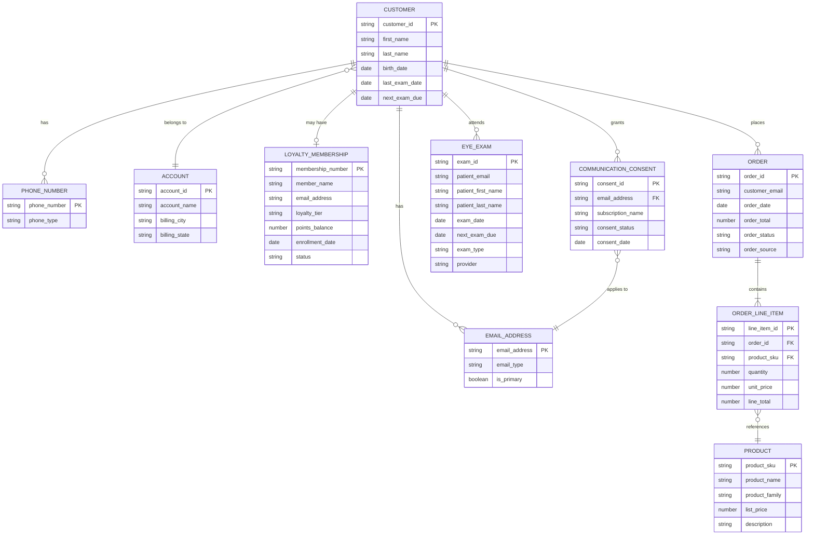
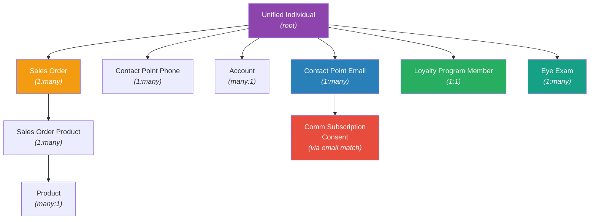

## Overview

Every MCA engagement starts with a data model conversation. Before you build segments, configure identity resolution, or personalize emails, you need a clear picture of what data exists, where it lives, and how the pieces connect. This is that conversation for LEOptical.

In the previous subpages, you toured the auto-installed CRM data streams, learned the refresh chain, and ingested LEOptical's external CSV data. Now you step back and look at the full picture. You will review the target entity relationship diagram, understand why each DMO was chosen, and verify that your org's data model matches the design.

This is also where you start thinking about downstream use cases. The data model you verify here is what powers segmentation, identity resolution, and email personalization later in the course. If a relationship is missing or misconfigured, those features break in ways that are hard to debug. Getting the data model right is worth the time.

## Lesson overview

This section contains a general overview of topics that you will learn in this lesson.

- The full LEOptical entity relationship diagram
- How each business entity maps to a Data 360 DMO
- Why certain DMOs are standard and one is custom
- How to define and verify DMO relationships
- The difference between standard (auto-activated) and custom (manually defined) relationships
- How the Data Graph connects to Unified Individual
- What segments this data model enables

## The ERD

Here is the full LEOptical data model. Every entity represents a DMO in Data 360, and every line represents a defined relationship between DMOs.

This is a business-level ERD. It shows entities the way LEOptical thinks about them: customers, orders, exams, loyalty memberships. The next section maps each entity to a specific Data 360 DMO and explains the design decisions behind the mapping.

## DMO mapping

Each business entity maps to a Data 360 DMO. Some map to standard DMOs that ship with the platform. One requires a custom DMO.

| Business Entity | Data 360 DMO | DMO Type | Source | Ingestion Method |
|----------------|-------------|----------|--------|-----------------|
| Customer | **Individual** | Standard | CRM Contact | Auto (Marketing Data Kit) |
| Email Address | **Contact Point Email** | Standard | CRM Contact + CSV email fields via IDR | Auto + IDR |
| Phone Number | **Contact Point Phone** | Standard | CRM Contact | Auto (CRM) |
| Account | **Account** | Standard | CRM Account | Auto (CRM) |
| Loyalty Membership | **Loyalty Program Member** | Standard + custom fields | `loyalty_members.csv` | CSV data stream |
| Order | **Sales Order** | Standard (manually enabled) | `ecommerce_orders.csv` | CSV data stream |
| Order Line Item | **Sales Order Product** | Standard (manually enabled) | `ecommerce_orders.csv` | CSV data stream |
| Product | **Product** | Standard | CRM Product (anonymous Apex) | Auto (CRM) |
| Eye Exam | **Eye Exam** | **Custom** | `exam_history.csv` | CSV data stream |
| Communication Consent | **Comm Subscription Consent** | Standard | Consent automation flow + landing page forms | Flow/form-created |
| (resolved identity) | **Unified Individual** | Standard | System-generated post-IDR | Automatic |

A few things to notice:

- **Most entities use standard DMOs.** Data 360 ships with 89+ standard DMOs across subject areas like Party, Commerce, Loyalty, Privacy, and Sales Order. The official recommendation is to use standard DMOs before creating custom ones.
- **Loyalty Program Member is standard but has custom fields.** The standard DMO covers membership number, name, enrollment date, and status. LEOptical's tier and points data required custom fields added to the standard DMO.
- **Eye Exam is the only custom DMO.** No standard DMO exists for clinical exam records. This is a common pattern: most B2C concepts fit the standard model, but industry-specific entities (eye exams, insurance policies, patient records) need custom DMOs.
- **Unified Individual is not something you create.** It is generated automatically after identity resolution runs. You will configure that in the <ModuleLink slug="identity-resolution" /> module.

## Relationship design decisions

The relationships between DMOs are not arbitrary. Each one exists to support a specific downstream use case, usually segmentation or personalization.

### Why standard DMOs matter here

Standard DMOs come with built-in relationships that activate automatically once there is at least one field mapping between the related DMOs. You do not need to manually wire up the relationship between Individual and Contact Point Email, for example. It exists out of the box.

Custom DMOs do not get this benefit. You must explicitly define every relationship. This is one of the key tradeoffs: standard DMOs reduce configuration work and integrate with platform features (segmentation, IDR) automatically. Custom DMOs give you control over the schema but require more manual setup.

### Key relationship decisions

**Individual to Contact Point Email (1:many).** A customer can have multiple email addresses across systems. CRM has one, the loyalty platform might have another, the ecommerce system might have a third. Each becomes a separate Contact Point Email record. This is critical for identity resolution, which matches Unified Individuals across sources using email addresses.

**Individual to Sales Order (1:many).** A customer places many orders over time. This relationship enables the "Lapsed Buyers" segment: find Unified Individuals whose most recent Sales Order is older than 180 days.

**Sales Order to Sales Order Product (1:many).** Each order contains line items. Each line item references a Product. This two-hop relationship (Sales Order to Sales Order Product to Product) is what powers the "SeeClear Enthusiasts" segment: find customers who bought products in the SeeClear family.

**Individual to Loyalty Program Member (1:1).** Each customer has at most one loyalty membership. This enables segments based on tier (`Loyalty Tier` = Gold or Platinum) and points balance.

**Individual to Eye Exam (1:many).** A customer can have multiple eye exams over time. This is the relationship that powers the "Exam Overdue" segment: find customers whose last exam was more than 12 months ago.

**Comm Subscription Consent to Contact Point Email.** Consent records relate to an email address, not directly to an Individual. This is a platform-specific design choice covered in <ModuleLink slug="consent-configuration" />.

### What this enables

Here is a preview of what segments this data model supports. You will build these in the <ModuleLink slug="segmentation" /> module.

| Segment | DMO Traversal |
|---------|---------------|
| VIP Customers | Unified Individual > Loyalty Program Member > `Loyalty Tier` = Gold or Platinum |
| Lapsed Buyers | Unified Individual > Sales Order > `Order Date` (most recent) > 180 days ago |
| SeeClear Enthusiasts | Unified Individual > Sales Order > Sales Order Product > Product > `Product Family` = "SeeClear" |
| Exam Overdue | Unified Individual > Eye Exam > `Exam Date` > 12 months ago |

A simpler data model with only Individual and Contact Point Email could not support any of these segments. Every additional DMO and relationship you define expands what you can do with segmentation and personalization.

## DMO relationships in practice

If you completed the previous subpage, your DMOs already exist. Standard DMO relationships (like Individual to Contact Point Email) activate automatically when field mappings are in place. But the custom Eye Exam DMO needs its relationships defined manually, and you should verify that all other relationships are correctly configured.

### How to define a relationship

1. Navigate to **Data Cloud > Data Model**.
2. Select the DMO you want to add a relationship to (for example, **Eye Exam**).
3. Open the **Relationships** tab and click **Edit**.
4. Click **+ New Relationship**.
5. Set the **cardinality** (1:1, 1:N, or N:1). For Eye Exam to Individual, this is N:1 (many exams belong to one individual).
6. Select the **related object** (Individual).
7. Select the **related field** that links the two objects.
8. Click **Save**.

:::warning
Cardinality cannot be changed after a relationship is created. If you set it wrong, you must delete the relationship and recreate it. Think carefully before saving. Cardinality affects how segmentation and activation treat the related records.
:::

### Standard vs custom relationships

There are three relationship types available:

- **Many-to-one lookup** (N:1): Many records in this DMO point to one record in the related DMO. Example: many Eye Exams belong to one Individual.
- **One-to-many child** (1:N): One record in this DMO has many related records. Example: one Sales Order has many Sales Order Products.
- **Many-to-many bridge**: Two DMOs relate through a bridge object. Less common in this data model.

Standard DMO relationships are built-in. They activate automatically once at least one field mapping exists between the related DMOs. You do not create these. They just work.

Custom relationships must be explicitly defined using the steps above. There is one more thing to know: a custom relationship is deleted automatically when the field mappings for one of the related objects are removed. If you remove all field mappings from the Eye Exam DMO, any custom relationships you defined for it disappear too.

:::tip[Coming from MCE?]
- In MCE, all data extensions are custom-created. There is no concept of "standard" data extensions with built-in relationships. In Data 360, standard DMOs with automatic relationships are the default, and custom DMOs are the exception.
- Contact Builder in MCE lets you define relationships between data extensions for cross-object queries. DMO relationships serve the same purpose but come in two varieties: standard (automatic) and custom (manual).
- The biggest practical difference: in MCE, you build the entire data model from scratch every time. In Data 360, the standard DMOs give you a head start, and you only build custom DMOs for entities the platform does not already know about.
:::

## Data Graph structure

The Data Graph is how Data 360 pre-computes the related records for each Unified Individual. It is what powers Handlebars personalization in emails and dynamic content resolution. You will configure it in the <ModuleLink slug="data-graphs" /> module. For now, understand its structure.

The LEOptical Data Graph is rooted on **Unified Individual**. From there, it branches out to every related DMO:

The root is Unified Individual, not Individual. This matters. Individual is the DMO that holds source records from CRM. Unified Individual is the post-IDR resolved identity that ties together records from all sources. The Data Graph uses Unified Individual as its root because personalization and segmentation work on resolved identities, not raw source records. The <ModuleLink slug="identity-resolution" /> module covers how Unified Individuals are created.

Sales Order Product connects to Product through a many-to-one relationship. This means the Data Graph can traverse from a Unified Individual all the way to the specific products they purchased: Unified Individual > Sales Order > Sales Order Product > Product. This two-hop traversal is what makes the "SeeClear Enthusiasts" segment possible.

Comm Subscription Consent connects through Contact Point Email, not directly to Unified Individual. This is a platform-specific design decision related to how consent works in MCA.

## Assignment

> **The client wants:** A verified, documented data model that matches the target architecture. Before LEOptical's data can power segments and personalization, every DMO and relationship must be in place.

1. Review the LEOptical ERD above and compare it to the DMOs in your SDO. Navigate to **Data Cloud > Data Model** and confirm that every DMO from the mapping table exists.
2. For each DMO, open the **Relationships** tab and verify that the expected relationships are defined. Standard DMO relationships should already be active. If any custom relationships are missing (especially for Eye Exam), create them using the steps in the "DMO relationships in practice" section.
3. Verify your relationships are correctly defined by navigating the data model graph view in **Data Cloud > Data Model**. Trace a path from Individual through Sales Order to Sales Order Product to Product. Trace another path from Individual to Eye Exam.
4. Write a brief data model summary document. For each of the 11 DMOs (including Unified Individual), write one paragraph explaining what it holds, where its data comes from, and how it connects to the rest of the model. This is the kind of deliverable you would present to a client during a data model review.

## Success criteria

- [ ] All DMOs from the target data model exist in your org (Individual, Contact Point Email, Contact Point Phone, Account, Loyalty Program Member, Sales Order, Sales Order Product, Product, Eye Exam, Comm Subscription Consent, Unified Individual)
- [ ] All relationships between DMOs are defined (verify via the Relationships tab on each DMO)
- [ ] You can navigate the data model in **Data Cloud > Data Model** and trace relationships between entities
- [ ] Data model summary document is written (one paragraph per DMO)
- [ ] You can explain why Eye Exam is a custom DMO while Sales Order is standard

## Knowledge check

The following questions are an opportunity to reflect on key topics in this lesson. If you can't answer a question, revisit the relevant section, but keep in mind you are not expected to memorize or master this knowledge.

- Why is the Data Graph rooted on Unified Individual rather than on Individual?
- What happens if you set the wrong cardinality on a DMO relationship?
- Why does LEOptical use a custom DMO for eye exams but a standard one for sales orders?
- How do standard DMO relationships differ from manually created ones?
- What segments could this data model support that a simpler model (just Individual and Contact Point Email) could not?
- How does the two-hop relationship from Sales Order through Sales Order Product to Product enable product-family-based segmentation?

## Additional resources

These resources are not required. They are here if you want to go deeper on a specific topic.

- [Standard DMOs (Salesforce Developers)](https://developer.salesforce.com/docs/data/data-cloud-dmo-mapping/guide/c360dm-si-entity-interface-dmos-introduction.html) - Official reference for all standard DMOs, including API names and field definitions.
- [Data 360 Connectors and Integrations: Connect and Map Data (Trailhead)](https://trailhead.salesforce.com/content/learn/modules/data-cloud-connectors-and-integrations/connect-and-map-data) - Covers DMO relationships, cardinality, and category inheritance in detail.
- [How to: Data Model Object (Salesforce Dictionary)](https://salesforcedictionary.com/how-to/data-model-object) - Step-by-step guide for creating custom DMOs and defining relationships.
- [Salesforce Data 360 Data Modelling (David Palencia)](https://davidpalencia.com/salesforce-data-cloud-data-modelling/) - Data modeling phases and relationship configuration best practices.
